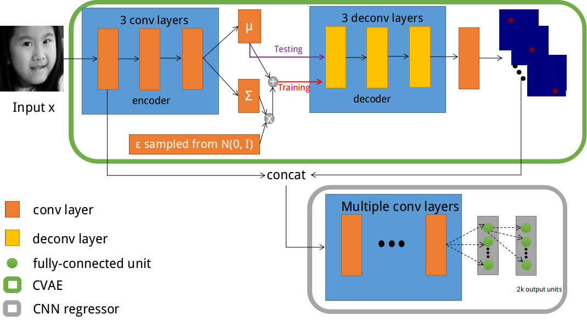
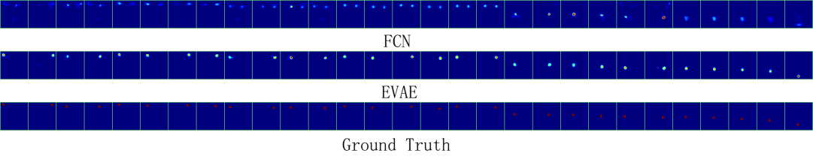
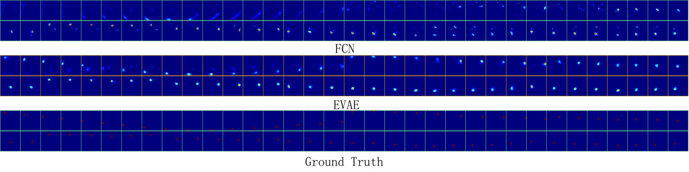
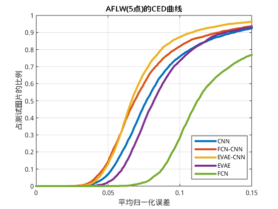
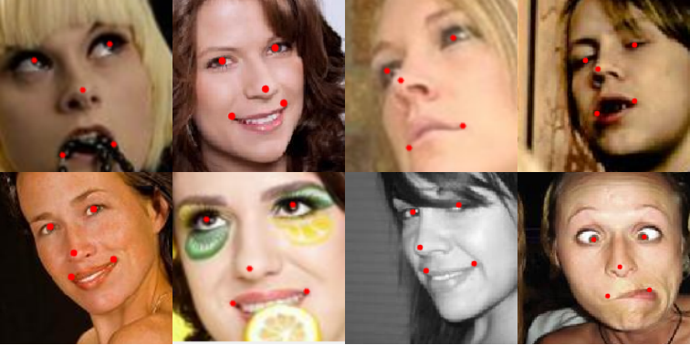
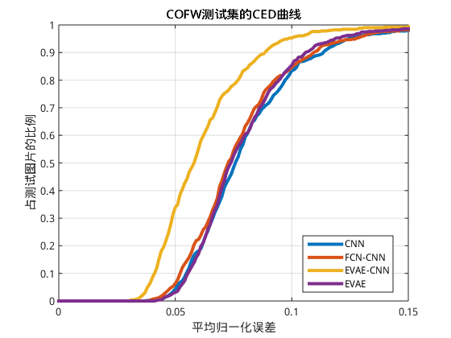
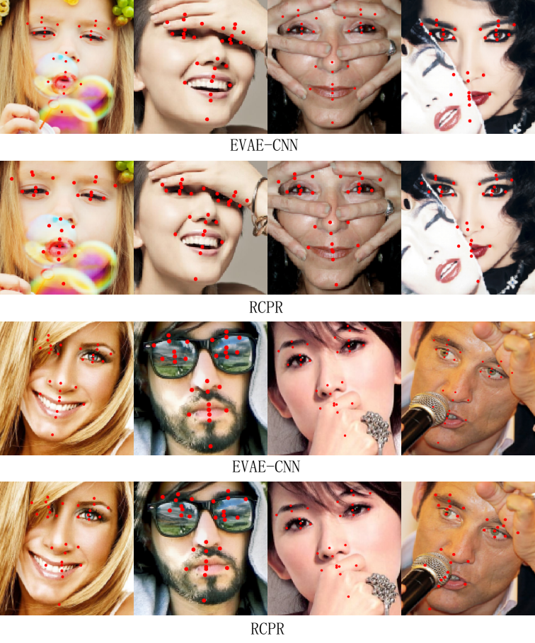
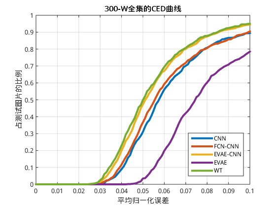
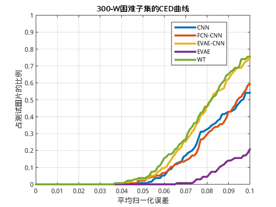
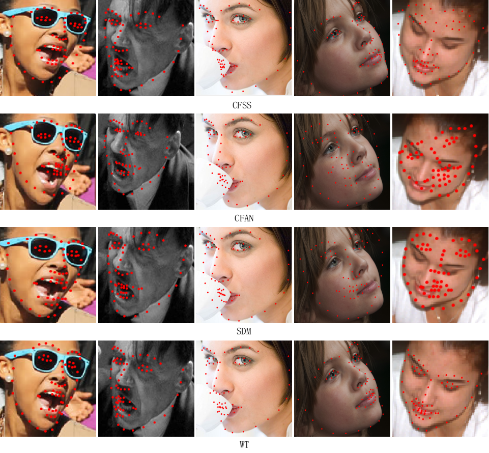

# Face alignment using Extended Variational AutoEncoder

## Brief introduction

To better apply deep learning for face alignment, this paper proposes a deep architecture which can locate landmarks accurately by learning local responses of facial landmarks(EVAE-CNN). The network consists of a Extended Variational Auto-Encoder(EVAE) and a Deep Convolutional Neural Network(DCNN). The EVAE consists of a face encoder, which extracts high-level information from raw pixels, and a decoder which outputs local response maps from high-level coding. We derive the EVAE used for catching local responses as an optimization problem which can be solved through back-propagation. Experiments on AFLW, COFW and 300-W show that the proposed method performs much better than baseline and achieves state-of-the-art performance in the condition of complex poses, expressions and occlusions.

## Overall pipeline

The pipeline of the method is shown as following, an EVAE is used to learn the response maps of the landmarks, and a DCNN to regress landmark locations accurately.

## Local response learning

Once we remove the sampling operation in the EVAE, the network becomes a FCN. Experiments on 3 datasets show that EVAE outperforms FCN in learning local responses.

Local response learned on AFLW dataset:

Local response learned on COFW dataset:

Local response on 300-W dataset:

## Results

Experiments on 3 datasets show that this method performs well in complex conditions. Note that *EVAE-CNN* and *WT* are models trained with the proposed method.

Results on AFLW dataset:

CED curve:

Sample results:

Results on COFW dataset:

CED curve:

Sample results:

Results on 300-W dataset:

CED curve on Common subset:

CED curve on Challenging subset:

Sample results:

## Conclusion

This work proposes to improve the accuracy of facial landmark detection by learning local responses of facial landmarks. A EVAE is used to learn local responses and a CNN regressor is trained to fit the landmark locations with the guide of the learned local responses. The EVAE imposes a constraint on the output response maps which forces the model to learn the relationship between responses of different landmarks. So, the local response maps learned by EVAE are much smoother than those learned by FCN. Extensive experiments show that the learned local responses do serve as a good guidance for better localization accuracy, and the proposed EVAE-CNN achieves superior performance in coping with significant poses and expressions. 
